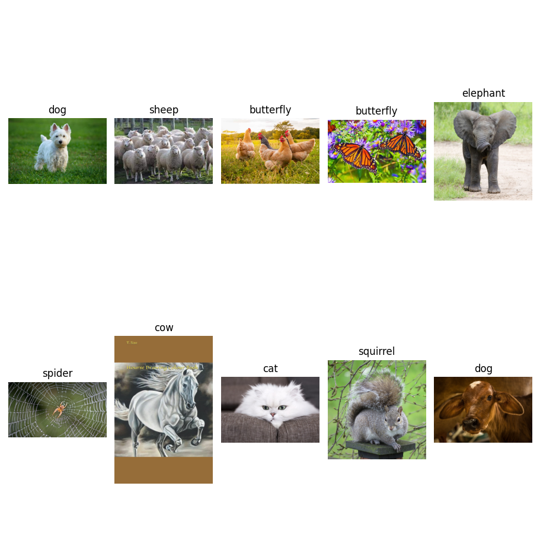
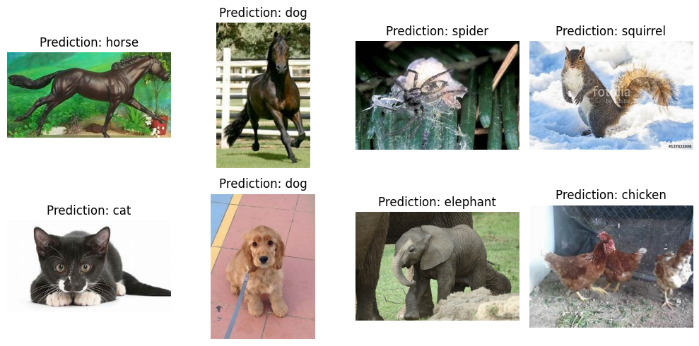

# VGG16-pytorch-implement
## Introduction
Here is pytorch implementation of VGG16 from scratch. It was trained on animal dataset for animal classification. It is a pratical project for basic skills in computer vision.
You can down load dataset from [here](https://www.kaggle.com/datasets/alessiocorrado99/animals10/)

## Result
Due to hardware limitations, I only trained the model for approximately 28 epochs, with the highest recorded accuracy reaching 88.71%.
<p align="center">
  <br/>
  <i>Figure_1</i>
</p>
<p align="center">
  <br/>
  <i>Figure_2</i>
</p>

## How to use
You can use my code as a learning material for computer vision when getting started with computer vision and wanting to code a model from scratch.
Run the following command to install modules needed 
```bash
pip install -r requirements.txt
```
The code was organized: 
* *Transform needed for image pre-processing:* **transforms.py**
* *Dataset was implemented in:* **dataset.py**
* *Model architecture was implemented in:* **vgg16_model.py**
* *Script to train model:* **train.py**
* *Test the model with new image:* **test.py**
* *In the notebook directory, you can also use* **animals_classification.ipynb** *and adjust some things accordingly your conditions to train on notebook or Google colab.*


